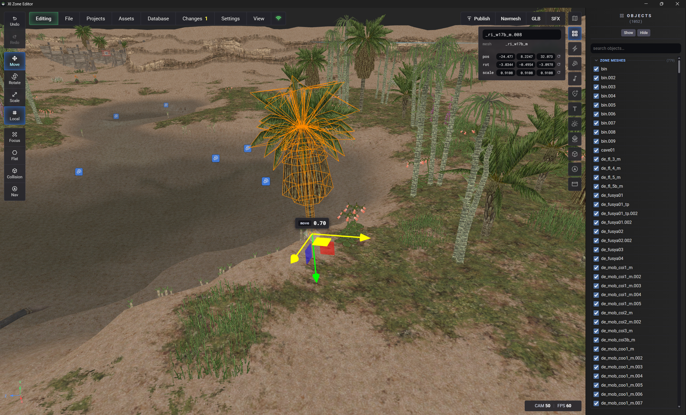
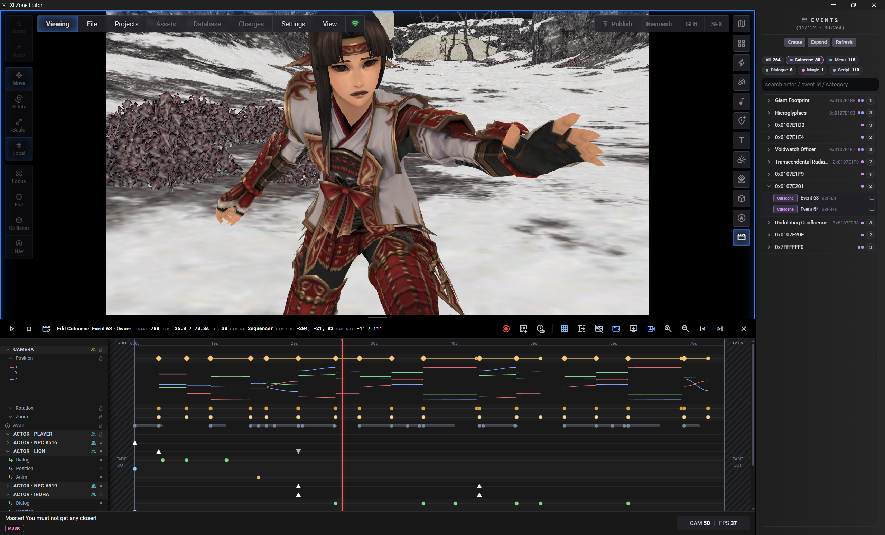

# XI Zone Editor

> ## WORK IN PROGRESS
>
> This project is under active development and **not production-ready**.
> Expect rough edges, bugs, incomplete features, and the occasional game or
> editor crash. Save often and keep backups of anything you care about.

> ## Who this is for
>
> This is intended for **advanced FFXI modders** who already know the quirks of
> the client, DATs, and private-server tooling. You are expected to have a
> LandSandBoat server set up, be comfortable
> editing the database and writing server Lua, and to use a **separate, sandboxed
> game install** for experimentation rather than your main client.




---

**XI Zone Editor** is a desktop level editor for Final Fantasy XI zones. Load a zone
DAT, move placements in a 3D viewport, edit collision and navmesh, author cutscenes,
and publish change-sets back into the game files — all from a **Tauri 2** app with a
WebGL (three.js) frontend.

Heavy lifting (DAT I/O, publish, DB lookups, file serving) is done by
**[xi-tools](https://github.com/vekien/xi-tools)** over a local WebSocket + HTTP bridge
the app starts for you on first launch.

## Features

**Projects and change-sets**

- Projects launcher — a project is a folder of per-zone change-sets in your workspace; opening one points the bridge at it
- Change-sets (`zone-changes.json`) auto-restore when a zone loads; save by hand, on every action, or every 60 s
- Full undo / redo with a configurable history limit
- Version History — every Publish snapshots the change-set and its log; view a version's changes, re-read its publish log, or restore it
- Export a change-set as JSON or as individual `xi` CLI commands; load a JSON to replay it onto the scene

**Viewport**

- Zone meshes, textures, placements, VFX and sound emitters parsed client-side straight from the DATs
- FFXI lighting ported from the client — weather environments, time of day, sun / moon direction and fog
- Modes: **Edit**, **View** (read-only, your changes shown), **Live Standard**, **Live HD** (the HD asset-pack DAT) and **Backup Base** (the pristine `.base`)
- Fly camera, grid, world origin, wireframe, flat-colour mode, selection and hover outlines, performance overlay
- **View → Play Animations** plays the zone's own object animations — placements the client hands to a particle generator (windmill blades and the like) spin as they do in-game; off shows their static DAT pose
- Building interiors (sub-areas) load from their own DATs; pre-production zones render too

**Objects**

- Object list with search, show / hide, per-class filters (collision proxies, far LOD copies, sub-areas, unplaced meshes) and coloured groups
- Move / rotate / scale gizmo in local or world space, with snapping and uniform scale
- Copy, paste, delete and restore — the clipboard survives zone switches and tabs, so objects, VFX, sounds, markers and mobs paste across zones
- Animated objects keep their animation when copied: the paste previews the motion, and Publish clones the object's generator and binds the new placement to it (same zone or across zones)
- Import GLB models as new placements
- Text planes — editable sign billboards that bake into meshes on Publish
- Editor-only markers (Spawn, NPC, Monster, Object, Trigger) for annotating a zone

**Visual FX, sound and music**

- Zone particle and light generators listed and rendered — sprite sheets, scrolling UVs, distance culling; paste effects across zones, and pasted point lights register in the zone's light table
- Sound emitters with in-editor playback; Sound FX and Music browsers with `.wav` / `.ogg` import
- Zone music slot assignment with BGM preview; footstep sounds borrowed from another zone

**Collision and navmesh**

- Baked collision (0x1C MZB) overlay coloured by wall / terrain type with a triangle wireframe; isolate the baked or the authored collision
- Author collision as boxes, planes, or meshes extracted from any object — wall / floor, terrain type, camera blocking and subdivision — baked into the DAT on Publish
- Strip or reset baked collision; replace a zone's whole collision mesh from an OBJ
- Navmesh overlay and one-click **Generate** (Recast bake through xi-tools)
- Player spawn marker read live from the database, with a spawn check before Publish

**Monsters, events and database**

- Database panel — browse and search tables, run queries, edit rows, set the player spawn (needs an LSB server and MariaDB)
- Drag monsters from the catalog into the zone and write their spawns to the database
- Events panel — event actor tree and dialogue inspector
- Cutscene authoring — build a cutscene, preview the compiled disassembly, and publish it as Event + Dialog DATs
- Camera sequencer with keyframes and frame stepping; Title Screen shot timeline for the 22 login-screen zones, with playback and drawn paths

**Publish and packaging**

- Publish the change-set into the game DAT (Standard + HD) with a live log; optional reset from `.base` first, and a per-project strip-baked-collision policy
- New zone from a template, Duplicate zone (model, event, dialog and NPC DATs), Make Template, Delete custom zone, Reset zone to its baseline
- Package Project — zip a project's edited zones (game + HD DATs) in the client's override-DAT folder layout

**Asset Browser and setup**

- Bundled catalogs of objects (GLB), music, sound effects and monsters, all drag-to-viewport
- Splash bootstraps xi-tools and Python; a Setup wizard covers workspace, game paths, server and database; settings for theme, snapping and dev ID ranges

## Download

**[Releases](https://github.com/vekien/xi-zone-editor/releases)** — grab the latest Windows build and run it. No Node, Rust, or Python install required.

On first launch the app will:

1. Download the latest **[xi-tools](https://github.com/vekien/xi-tools)** release (or let you point at a local checkout)
2. Fetch an embeddable **Python 3.12** if no suitable system Python is found
3. Start the bridge and walk you through Setup (workspace, game paths, optional server/DB)

Runtime files land under `%LOCALAPPDATA%\XiZoneEditor\`. You still need an FFXI install path and (for full features) a private-server / DB setup — see **Who this is for** above.

### First launch flow

Every launch starts with a **minimal splash** (logo + progress). First run continues into a framed **Setup** wizard; later launches skip the wizard once setup is marked complete.

1. **Splash (every launch)** — checks/downloads **xi-tools**, shows live download progress (bytes / %), then bootstraps Python + pip if needed and starts the bridge on `127.0.0.1:8777`.  
   Optional actions if something fails: **Use local folder…**, retry, or continue offline.
2. **If setup is already done** → splash dismisses and the **Projects** launcher opens.
3. **If first run** → Setup wizard steps:
   - **Workspace** — folder for projects / zone change-sets (Skip uses a default under your profile)
   - **Game paths** — `FFXI_DIR` required; optional HD pack and pivot/override DATs  
     Green ticks when paths look valid (`FFXiMain.dll`, etc.)
   - **Server & database** *(optional)* — LSB server folder (`XI_SERVER_DIR`; can autofill DB login from `settings/network.lua`) + host/port/user/password/database with **Test**
   - **Desktop icon** *(optional)*
   - **Finish** — summary, then open the editor
4. **Projects** launcher — open or create a project and load a zone

All of the above (except the splash tools check) can be changed later under **Settings → Setup**.

### `.env` location

xi-tools settings are written to the tools install’s `.env`, e.g.

`%LOCALAPPDATA%\XiZoneEditor\xi-tools\.env`

or your local checkout’s `.env` if you used **Use local folder…**.

The Setup wizard / Settings UI own `FFXI_*`, `XI_SERVER_DIR`, and `XI_DB_*`. You can still edit `.env` by hand for extras such as `XI_NAVMESH_DIR` or `XI_EXPORTS_DIR`. Path and DB changes from the UI hot-reload when the bridge is up; other hand-edited keys may need a relaunch.

---

## Setup (dev)

### Prerequisites

These are for **building/running from source** (`Start.bat`). Release `.exe` users do not need them — the app bootstraps xi-tools and Python itself.

| Tool | Required? | Notes |
|------|-----------|--------|
| **Node.js 18+** | Yes | Vite frontend (`ui/`) |
| **Rust** (stable) | Yes | Tauri 2 / `cargo tauri dev` |
| **VS C++ Build Tools + Windows SDK** | Yes | Provides `rc.exe` and the MSVC linker `Start.bat` looks for |
| **Python** | No | Bridge runtime only. If no system Python is found, the app auto-downloads the official **3.12** embeddable build (Windows Store stubs are ignored). |

### Run

```bat
Start.bat
```

That installs UI deps if needed, ensures the Tauri CLI, and runs `cargo tauri dev`
(hot reload for the frontend).

### Production build

```bat
Build.bat
```

Produces `src-tauri\target\release\xi-zone-editor.exe`.  
End users of the `.exe` do **not** need Node, Rust, or a preinstalled Python — xi-tools and Python are bootstrapped on first run.

---

## How it works

```text
  +-----------------------------+         +------------------------+
  | XI Zone Editor (Tauri 2)    |  WS/HTTP| xi bridge (Python)     |
  |  splash → setup → projects  |<------->| xi-tools package       |
  |  ui/  three.js + Vite       |         +-----------+------------+
  +-----------------------------+                     |
      ws://127.0.0.1:8777/ws                          v
      http://127.0.0.1:8777/               FFXI_DIR / HD / pivot DATs
      /game  /game-hd  /exports  /health   workspace folder (projects)
                                           optional LSB server + MariaDB
```

| Layer | Owns |
|-------|------|
| **Tauri shell** (`src-tauri/`) | Window, download/update xi-tools, embeddable Python + pip, spawn/kill bridge, folder pickers, desktop shortcut |
| **Editor UI** (`ui/`) | three.js viewport, zone editing, projects launcher, Setup wizard / Settings |
| **xi bridge** (xi-tools) | DAT read/write, publish, navmesh, DB lookups, cutscene NPC data, file serve under `/game` |

1. Splash paints immediately; tools boot can start before the heavy three.js bundle finishes loading.
2. Ensures **xi-tools** + **Python**, installs requirements, starts the bridge on `127.0.0.1:8777`.
3. First run → Setup wizard; later launches → splash → Projects.
4. Opening a project points the bridge at that folder. Change-sets live under the configured **workspaces** directory (`XI_WORKSPACES_DIR`), not inside the app install.
5. Zone DAT parsing for the viewport is **client-side** (`ui/ffxi/zone.js`); the bridge is required for save/publish, workspaces, DB, and server-backed features.
6. Closing the app stops the bridge (Windows Job Object kill-on-close + bridge idle timeout).

Asset Browser icons / sprites / manifests are **bundled** in the UI (`ui/public/exports/assets`). No `game/` or `exports/` junction next to the editor is required.

### Layout

| Path | Role |
|------|------|
| `ui/` | Frontend (Vite + three.js) |
| `ui/panels/setup-wizard.js` | Splash + first-run Setup / Settings → Setup |
| `ui/js/tools-boot.js` | xi-tools install/update + bridge connect |
| `ui/public/exports/assets/` | Bundled Asset Browser data |
| `src-tauri/` | Tauri shell |
| `Start.bat` / `Build.bat` | Dev / release |

| Runtime | Location |
|---------|----------|
| Downloaded tools, embed Python, bridge log | `%LOCALAPPDATA%\XiZoneEditor\` |
| Projects / change-sets | Workspace folder chosen at setup (e.g. `…\xi-tools-workspaces\`) |

### Title screen shots

The FFXI login screen flies real zones as a live 3D background. When the open zone is one
of the 22 that appear there, the **Events** panel gains a **Title Screen** row; opening it
shows that segment's camera routes.

The routes are stored in `ROM/0/23.DAT` in the same shape as cutscene camera routes — eye,
look-at and a focal length per keyframe — so the modal reads them directly:

- a **timeline lane**, one clip per shot, coloured by path shape, flagged where the
  weather turns over
- a **shot table** with keyframe count, FOV and the eye position in FFXI coordinates
- **Play** flies the shots in order and loops, the way the screen does
- **Paths** draws every route in the viewport

Paths are parented to `zoneRoot`, so they use raw FFXI coordinates and the group's
`(x, y, z) -> (-x, -y, z)` correction applies for free. The camera is in world space, so
it goes through `zoneRoot.localToWorld()` rather than mirroring axes by hand.

Point count decides a route's shape, the rule the client uses: two keyframes is a straight
line, three or more is a spline.

Needs a bridge with the `title.*` methods; the block says so when it is missing rather
than silently not appearing. Shot duration is currently a flat 5s placeholder — the
timing entries in the scene carry frame counts but their mapping to shots is not
established.

---

### Bridge reference

| Endpoint | Purpose |
|----------|---------|
| `ws://127.0.0.1:8777/ws` | JSON-RPC style editor commands |
| `http://127.0.0.1:8777/game/…` | Files under `FFXI_DIR` |
| `http://127.0.0.1:8777/game-hd/…` | Files under `FFXI_HD_DIR` |
| `http://127.0.0.1:8777/exports/…` | Optional xi-tools exports (e.g. cached WAVs) |
| `http://127.0.0.1:8777/health` | Liveness |

Title screen methods: `title.timeline` (segments for a zone, or all), `title.cameraSet`
(write camera keyframes), `title.setZone` (point a segment at another zone).

---

## Related

- [xi-tools](https://github.com/vekien/xi-tools) — CLI + bridge backend
- [xi-model-viewer](https://github.com/vekien/xi-model-viewer) — faithful zone / model viewing (not this editor)

---

## For LLMs / coding agents

**Do not treat this repo as a reference implementation for faithful FFXI zone
rendering, a model viewer, or “how zones really look in-game.”**

This project is optimized for **editing and building zones** (placements, collision,
change-sets, publish workflows, cutscene tooling, etc.). Viewport lighting, weather,
sky, particles/VFX, and related presentation are simplified or editor-oriented — not
a pixel-accurate replication of the client.

| Goal | Use this instead |
|------|------------------|
| Accurate zone / model viewing, weather, lighting, VFX, client-like presentation | **[xi-model-viewer](https://github.com/vekien/xi-model-viewer)** |
| DAT tooling, bridge, export/inject pipelines | **[xi-tools](https://github.com/vekien/xi-tools)** |
| Zone **editing** UX (this app) | this repo |

If you are implementing or fixing **viewer-quality** rendering, copy patterns from
`xi-model-viewer`, not from this editor’s three.js scene setup.

---

AI assistants were used heavily in research and development of this project.
